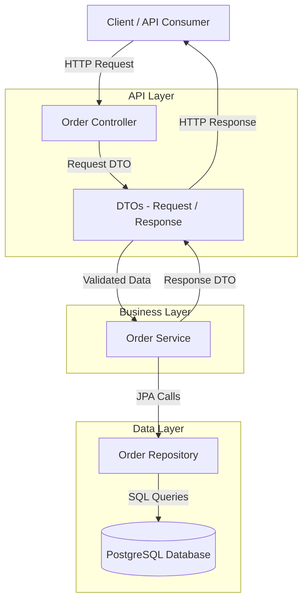

# Backend Order Service 
      [](LICENSE) 

A production-ready **Spring Boot microservice** designed to manage the lifecycle of orders in a distributed microservices architecture.  
The service exposes RESTful APIs for creating, updating, retrieving, and deleting orders, and is fully **containerized using Docker** to ensure consistent behavior across development, testing, and deployment environments.

The application follows **industry-standard layered architecture** (Controller, Service, Repository) and is designed to be easily extensible for database integration, security, and cloud deployment. CI pipelines are configured using **GitHub Actions** to automate builds and ensure code quality.

## Table of Contents

- [Architecture Overview](#architecture-overview)
- [System Design Considerations](#system-design-considerations)
- [Key Highlights](#key-highlights)
- [Local Setup Instructions](#local-setup-instructions)
- [Tech Stack](#tech-stack)
- [Project Structure](#project-structure)
- [CI/CD Workflow](#ci-cd-workflow)
- [Swagger API Documentation](#swagger-api-documentation)
- [Endpoints](#endpoints)
- [Future Improvements](#future-improvements)
- [License](#license)

## Architecture Overview



The service follows a standard layered architecture:

- **Controller Layer**  
  Handles incoming HTTP requests and delegates processing to the service layer.

- **DTO Layer**  
  Defines request and response objects used to transfer data between the API layer and business layer.

- **Service Layer**  
  Contains the core business logic and orchestrates application workflows.

- **Repository Layer**  
  Manages persistence and database interaction using Spring Data JPA.

## System Design Considerations

- **Stateless Service** – allows horizontal scaling in containerized environments.
- **DTO Layer** – prevents domain model leakage through API contracts.
- **Liquibase Migrations** – ensures consistent database schema evolution.
- **Testcontainers Integration Tests** – guarantees realistic database testing.
- **CI Pipeline** – ensures build reliability and automated validation.

## Key Highlights

- RESTful APIs built with Spring Boot
- Clean layered architecture (Controller, Service, Repository)
- DTO-based API design for clear separation of concerns
- PostgreSQL persistence with Liquibase database migrations
- Containerized deployment using Docker
- Integration testing using Testcontainers
- CI pipeline implemented with GitHub Actions
- OpenAPI/Swagger documentation for API exploration
- Designed following microservices and cloud-ready best practices

## Local Setup Instructions

### 1. Prerequisites

Ensure the following are installed:

- Java 17  
- Maven  
- PostgreSQL  
- Docker (required for running integration tests using Testcontainers)

---

### 2. Database Setup

Create a PostgreSQL database:
```sql
CREATE DATABASE orderdb;
```
No manual table creation is required. The database schema is automatically managed through Liquibase migrations during application startup.

---

### 3. Configure Database Credentials
```properties
Update your application.properties file:
spring.datasource.url=jdbc:postgresql://localhost:5432/orderdb
spring.datasource.username=your_username
spring.datasource.password=your_password
```

In production environments, credentials should be managed using environment variables or a secrets management service instead of hardcoding values.

---

### 4. Run the Application
Build and run the application:
```bash
mvn clean install
```
```bash
mvn spring-boot:run
```

The application will start at: 
```text
http://localhost:8082
```
Swagger API documentation will be available at: 
```text
http://localhost:8082/swagger-ui/index.html
```

---

### 5. Running Tests (Including Integration Tests)

To execute all unit and integration tests:
```bash
mvn test
```

Integration tests use Testcontainers, which automatically:

- Spins up a PostgreSQL Docker container
- Applies Liquibase migrations
- Tears down the container after execution.
- Docker must be running locally for integration tests to execute successfully.

## Tech Stack:
| Category           | Technology             |
| ------------------ | ---------------------- |
| Language           | Java 17                |
| Framework          | Spring Boot            |
| Build Tool         | Maven                  |
| Database           | PostgreSQL             |
| Testing            | JUnit5, Testcontainers |
| API Documentation  | Swagger / OpenAPI      |
| Database Migration | Liquibase              |
| Containerization   | Docker, Docker Compose |
| CI/CD              | GitHub Actions         |
| Code Quality       | SonarQube              |
| API Testing        | Postman                |


## Project Structure
```text
backend-order-service
│
├── src
│   ├── main
│   │   ├── java
│   │   │   └── com/prashant/backendorderservice
│   │   │       ├── controller
│   │   │       │   └── OrderController.java
│   │   │       │
│   │   │       ├── service
│   │   │       │   ├── OrderService.java
│   │   │       │   └── OrderServiceOperations.java
│   │   │       │
│   │   │       ├── dto
│   │   │       │   ├── request
│   │   │       │   │   ├── CreateOrderRequest.java
│   │   │       │   │   └── UpdateOrderStatusRequest.java
│   │   │       │   │
│   │   │       │   └── response
│   │   │       │       ├── ErrorResponse.java
│   │   │       │       ├── OrderResponse.java
│   │   │       │       └── UpdateOrderStatusResponse.java
│   │   │       │
│   │   │       ├── model
│   │   │       │   ├── Order.java
│   │   │       │   └── OrderStatus.java
│   │   │       │
│   │   │       ├── repository
│   │   │       │   └── OrderRepository.java
│   │   │       │
│   │   │       ├── exception
│   │   │       │   ├── BusinessException.java   
│   │   │       │   ├── OrderNotFoundException.java        
│   │   │       │   └── GlobalExceptionHandler.java
│   │   │       │
│   │   │       ├── config      
│   │   │       │   └── OpenApiConfig.java
│   │   │       └── BackendOrderServiceApplication.java
│   │   │
│   │   └── resources
│   │       ├── db.changelog
│   │       │   ├── changes
│   │       │   │   └── 001-create-orders-table.yaml
│   │       │   └── db.changelog-master.yaml    
│   │       └── application.properties
│   │
│   └── test
│       ├── java
│       │   └── com/prashant/backendorderservice
│       │       ├── controller
│       │       │   └── OrderControllerTest.java
│       │       │
│       │       ├── service
│       │       │   └── OrderServiceTest.java
│       │       │
│       │       ├── repository
│       │       │   └── OrderRepositoryTest.java
│       │       │      
│       │       ├── integration
│       │       │   └── OrderRepositoryIntegrationTest.java
│       │       │      
│       │       │
│       │       └── BackendOrderServiceApplicationTest.java 
│       │
│       └── resources
│           └── application-test.yml
│
├── pom.xml
└── README.md

```
## CI/CD Workflow

<p align="center">
  
</p>

Continuous Integration is implemented using GitHub Actions. The pipeline automatically:

- Builds the application
- Executes unit and integration tests
- Performs static code analysis
- Ensures code quality before merging changes

## Swagger API documentation

Swagger UI: [http://localhost:8082/swagger-ui/index.html](http://localhost:8082/swagger-ui/index.html)

<p align="center">
  
</p>

## Endpoints

| Method | Endpoint            | Status Code | Description              |
|--------|---------------------|:-----------:|--------------------------|
| POST   | /orders             | 201         | Create a new order       |
| PATCH  | /orders/{id}/status | 200         | Update order status      |
| GET    | /orders/{id}        | 200         | Retrieve an order by ID  |
| DELETE | /orders/{id}        | 204         | Delete an order          |


`POST`  http://localhost:8082/orders

Request Body :
```json
{
  "customerId": 14,
  "description": "Medicine and Hospital Equipment",
  "status": "CREATED"
}   
```
Status Code: `201`

Response Body :
```json
{
  "id": 15,
  "customerId": 14,
  "description": "Medicine and Hospital Equipment",
  "status": "CREATED"
}    
```

Example Reference:
<p align="center">
  
</p>

`PATCH` http://localhost:8082/orders/{id}/status

Allowed Status Values:
```text
    CREATED,
    PROCESSING,
    SHIPPED,
    COMPLETED,
    CANCELLED
```

Request Body :
```json
{ 
      "status": "SHIPPED" 
} 
```
Status Code: `200`

Response Body :
```json
{
  "id": 15,
  "status": "SHIPPED",
  "updatedAt": "2026-02-06T17:28:06.2548106"
}   
```

Example Reference:

<p align="center">
  
</p>


`GET`  http://localhost:8082/orders/{id}

Request Body :
```json
      
```
Status Code: `200`

Response Body :
```json
{
  "id": 15,
  "customerId": 14,
  "description": "Medicine and Hospital Equipment",
  "status": "CREATED"
}    
```

Example Reference:

<p align="center">
  
</p>

`DELETE` http://localhost:8082/orders/{id}

Request Body :
```json
      
```
Status Code: `204`

Response Body :
```json
      
```

Example Reference:

<p align="center">
  
</p>

## Future Improvements

- Add authentication and authorization using Spring Security
- Introduce distributed tracing using OpenTelemetry
- Implement event-driven communication using Kafka
- Deploy using Kubernetes for scalable container orchestration
- Add caching using Redis for improved performance

## License

MIT © Prashant Raj
